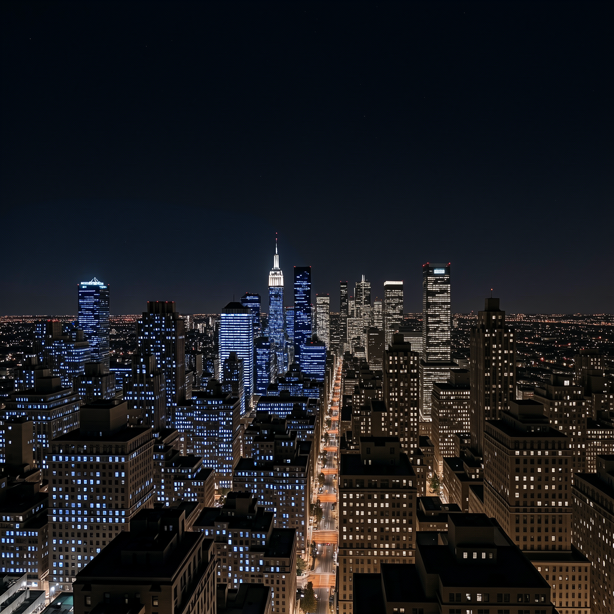

# LanPaint-Diffusers

Training-free diffusion inpainting and outpainting with [LanPaint](https://github.com/scraed/LanPaint), built on [Hugging Face Diffusers](https://github.com/huggingface/diffusers).

## Features

- **Diffusers-native**: Uses the `diffusers` library only. No ComfyUI or other graph-based UI dependency.
- **Multi-model**: One CLI and one pipeline API for all supported backends. Currently supported:
  - **Flux2 Klein** (`flux-klein`)
  - **Z-Image Turbo** (`z-image`)
  - **Stable Diffusion 3** (`sd3`)
  - **Qwen Image** (`qwen`) — thanks [@spartanz51](https://github.com/spartanz51)
- **Extensible**: More LanPaint-supported models will be added over time; new backends are integrated via the adapter registry.

---

## Usage

### Installation

- Python 3.10+ (3.12 tested), NVIDIA GPU and CUDA-compatible PyTorch recommended.
- **LanPaint** and **diffusers** are installed from GitHub (see `requirements.txt`); 

```bash
cd LanPaint-diffusers   # or your clone path
python -m venv .venv
source .venv/bin/activate   # Windows: .venv\Scripts\activate
pip install --upgrade pip
pip install -r requirements.txt
```

If you need a different PyTorch/CUDA build, install PyTorch first, then:

```bash
pip install -r requirements.txt --no-deps
```

Verify:

```bash
python -c "import torch, diffusers, LanPaint; print(torch.__version__, diffusers.__version__)"
python run_lanpaint.py --list-models
```

### Commands

**We recommend using the example commands in `run_lanpaint.sh`.** Uncomment the block you need (or run it as-is if one is already uncommented), then:

```bash
./run_lanpaint.sh
# or: bash run_lanpaint.sh
```

The script includes ready-to-run examples for:

- **List models**: `python run_lanpaint.py --list-models`
- **Flux2 Klein** (inpaint, URL or local image + mask)
- **SD3** (inpaint with example prompt and URLs)
- **Z-Image Turbo** (inpaint and outpaint, with `--outpaint-pad`)
- **Qwen Image** (inpaint )

**Quick reference** (same CLI, custom args):

- Inpaint: `--model <name> --prompt "..." --image <path-or-URL> --mask <path-or-URL>`
- Outpaint: `--model <name> --prompt "..." --image <path> --outpaint-pad l200r200t200b200` (no `--mask`; do not use `--height`/`--width` with `--outpaint-pad`)

**Useful options**: `--guidance-scale`, `--num-steps`, `--seed`, `--output <path>`, `--model-id <hf-or-local-path>`, `--save-preprocess-dir <dir>`, `--local-files-only`

### Mask convention (`--mask`)

The pipeline supports both standalone mask images and RGBA masks:

- **Binary/grayscale mask image** (`L` mode or RGB converted to grayscale):
  - **0** (black, or normalized **0.0**) = region to be edited (inpaint area)
  - **255** (white, or normalized **1.0**) = region to keep (non-editable)
- **RGBA mask image** (mask stored in alpha channel):
  - **alpha = 0** = region to be edited (inpaint area)
  - **alpha = 255** = region to keep (non-editable)
---

## Results Showcase

Below are visual examples for `flux-klein` and `z-image`. 

### Flux2 Klein (Example 24)

| Original | Masked | Diffusers Version | ComfyUI Version |
|:--------:|:------:|:-----------------:|:---------------:|
|  |  |  |  |

### Z-Image Turbo (Example 21)

| Original | Masked | Diffusers Version | ComfyUI Version |
|:--------:|:------:|:-----------------:|:---------------:|
|  |  |  |  |

---

## Library Structure

```
LanPaint-diffusers/
├── README.md
├── requirements.txt
├── run_lanpaint.py      # Unified CLI
├── run_lanpaint.sh      # Example commands
└── lanpaint_pipeline/
    ├── __init__.py
    ├── model_adapter.py   # Abstract adapter interface
    ├── pipeline.py        # LanPaintInpaintPipeline (orchestrator)
    ├── registry.py        # Model registry (flux-klein, sd3, z-image, qwen)
    ├── utils.py           # Blend, time helpers, image loading
    └── adapters/
        ├── __init__.py
        ├── flux_klein.py  # Flux2KleinAdapter
        ├── qwen.py        # QwenAdapter
        ├── sd3.py         # SD3Adapter
        └── z_image.py     # ZImageAdapter
```

- **LanPaintInpaintPipeline** (`pipeline.py`): model-agnostic flow (preprocess → encode → LanPaint Langevin + scheduler loop → decode → blend).
- **ModelAdapter** (`model_adapter.py`): abstract interface (encode_prompt, encode_and_prepare, mask_to_latent_space, prepare_timesteps, predict_x0, decode_latents). Each backend implements one adapter in `adapters/`.
- **Registry** (`registry.py`): maps model keys to pipeline class, adapter class, and default config; adding a model is done by registering one entry.

---

## Citation

If you use this repository or LanPaint in your work, please cite:

```bibtex
@article{
zheng2025lanpaint,
title={LanPaint: Training-Free Diffusion Inpainting with Asymptotically Exact and Fast Conditional Sampling},
author={Candi Zheng and Yuan Lan and Yang Wang},
journal={Transactions on Machine Learning Research},
issn={2835-8856},
year={2025},
url={https://openreview.net/forum?id=JPC8JyOUSW},
note={}
}
```
